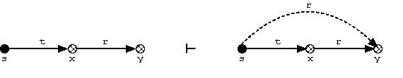
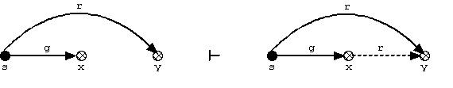
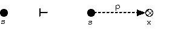

# Distribution of rights in TG-Protection Model

Coursework on the subject of Information Security in computer systems. Specialty of training - information security.

The take-grant protection model is a formal model used in the field of computer security. The model represents a system as directed graph. In my coursework i will distribute rights as much as possible by 7 rules:
### De-jure:
	1. Take

	2. Grant

	3. Create

### De-facto:
1. First
2. Second
3. Find
4. Spy
5. Pass
6. Post
